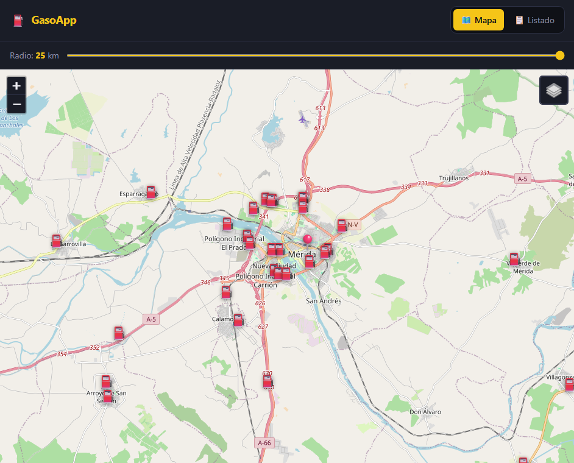
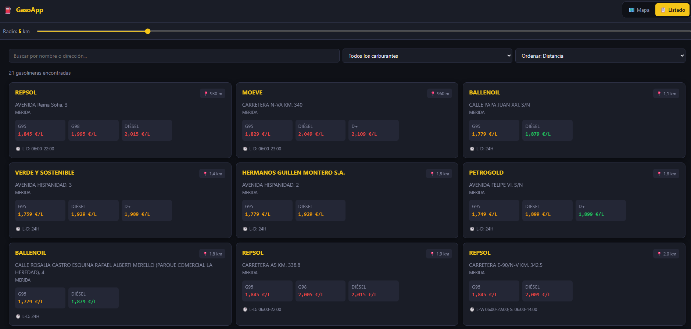

# ⛽ GasoApp — Precios de gasolineras cercanas


Aplicación web que muestra en tiempo real los precios de las gasolineras más cercanas a tu ubicación. Visualiza los datos en un mapa interactivo o en un listado filtrable y ordenable. Sin registro, sin API key, sin instalación.

---

## 📸 Captura de pantalla

| Vista mapa | Vista listado |
|---|---|
|  |  |

---

## ✨ Funcionalidades

- **Detección automática de ubicación** — GPS del dispositivo con doble fallback: geolocalización por IP si el GPS falla o está fuera de España, y campo manual si ambos fallan
- **Mapa interactivo** — marcadores coloreados por precio relativo (verde = más barato, rojo = más caro), popup con precios y horario, capas OSM y satélite Esri
- **Listado filtrable** — busca por nombre o dirección, filtra por tipo de carburante (G95, G98, Diésel, Diésel Premium), ordena por distancia, precio o nombre
- **Radio ajustable** — slider de 1 a 25 km (5 km por defecto)
- **Semáforo de precios** — coloreado relativo entre las gasolineras mostradas, no precio absoluto
- **Skeleton loader** — feedback visual mientras se cargan los datos
- **Diseño responsive** — mobile-first, optimizado para usarlo en el coche desde el móvil
- **Tema oscuro** — legible bajo el sol

---

## 🚀 Instalación y uso

No hay dependencias ni build. Solo abre el archivo en el navegador.

### Opción A — Live Server (recomendado para desarrollo)

```bash
# 1. Clona o descarga el repositorio
git clone https://github.com/tu-usuario/gasoapp.git
cd gasoapp

# 2. Abre la carpeta en VS Code
code .

# 3. Instala la extensión Live Server (si no la tienes)
#    Extensions → buscar "Live Server" de Ritwick Dey → Install

# 4. Clic derecho en index.html → Open with Live Server
```

El navegador se abrirá en `http://127.0.0.1:5500`. La geolocalización funciona en `localhost` sin HTTPS.

### Opción B — Servidor HTTP simple (Python)

```bash
# Desde la carpeta del proyecto
python -m http.server 8000
# Abre http://localhost:8000 en el navegador
```

### Opción C — Despliegue estático

Sube la carpeta entera a cualquier hosting estático:

| Plataforma | Comando / Pasos |
|---|---|
| **GitHub Pages** | Sube al repo → Settings → Pages → rama `main` → carpeta `/` |
| **Netlify** | Arrastra la carpeta a [netlify.com/drop](https://netlify.com/drop) |
| **Vercel** | `npx vercel` en la carpeta del proyecto |

> ⚠️ En producción (HTTPS) la geolocalización del navegador funciona sin problema. En `file://` local está bloqueada por los navegadores modernos — usa siempre un servidor.

---

## 🗂️ Estructura del proyecto

```
gasoapp/
├── index.html          # SPA única — estructura semántica y accesible
├── css/
│   └── styles.css      # Tema oscuro, variables CSS, responsive, animaciones
├── js/
│   ├── utils.js        # Funciones puras: Haversine, formateos, colores, XSS escape
│   ├── api.js          # Fetch a MITECO, normalización de datos, fallback CORS
│   ├── map.js          # Leaflet: marcadores, popups, capas OSM/Esri
│   ├── ui.js           # Grid de tarjetas, filtros, skeleton loader, estados error
│   └── app.js          # Orquestador: geolocalización → API → mapa + listado
├── assets/
│   └── icons/          # Iconos SVG (reservado para versiones futuras)
├── .env.example        # Variables de entorno (ninguna requerida actualmente)
├── CLAUDE.md           # Instrucciones para el asistente de IA
└── README.md           # Este archivo
```

---

## 🔌 Fuente de datos

| Dato | Fuente | Coste |
|------|--------|-------|
| Precios de carburantes | [API REST MITECO](https://sedeaplicaciones.minetur.gob.es/ServiciosRESTCarburantes/PreciosCarburantes/help) — Ministerio para la Transición Ecológica | Gratuita, sin API key |
| Teselas del mapa | [OpenStreetMap](https://www.openstreetmap.org) | Gratuitas |
| Imágenes satélite | [Esri World Imagery](https://server.arcgisonline.com) | Gratuitas (uso no comercial) |
| Geocodificación | [Nominatim](https://nominatim.openstreetmap.org) (OpenStreetMap) | Gratuita, sin API key |
| Geolocalización por IP | [ipapi.co](https://ipapi.co) | Gratuita (hasta 1000 req/día) |

Los precios se actualizan en la API del MITECO cada hora aproximadamente.

---

## 🧪 Cómo probar las funcionalidades clave

```
1. Detección automática
   → Abre la app → acepta el permiso de ubicación
   → Deben aparecer gasolineras en el mapa y en el listado

2. Fallback manual
   → Deniega el permiso de ubicación o usa VPN
   → Aparece el campo "Introduce tu localidad"
   → Escribe "Sevilla" y pulsa Buscar

3. Filtro por carburante
   → Vista Listado → selector "Todos los carburantes" → elige "Gasolina 95"
   → El listado se filtra y los marcadores del mapa cambian de color

4. Radio de búsqueda
   → Mueve el slider de 5 km a 15 km
   → La app relanza la búsqueda automáticamente

5. Ordenación
   → Vista Listado → "Ordenar: Distancia" → cambia a "Ordenar: Precio"
   → Las tarjetas se reordenan mostrando la más barata primero
```

---

## 🧠 Aprendido en este proyecto

> *Sección para portfolio — explica qué conceptos técnicos pusiste en práctica*

### APIs REST públicas
Consumo de una API gubernamental sin autenticación. Aprendí a leer la documentación oficial, identificar el endpoint correcto (hubo un cambio de dominio del MITECO que tuve que investigar) y normalizar una respuesta con formato español (comas como separadores decimales).

### Geolocalización con múltiples fallbacks
Implementé una cadena de tres intentos: GPS nativo → geolocalización por IP → entrada manual. Esto me enseñó el patrón de diseño de "estrategia con fallback" y la importancia de validar datos de terceros (el GPS devolvía coordenadas de California por una VPN activa).

### Leaflet.js y mapas web
Primera vez trabajando con una librería de mapas. Aprendí a gestionar capas, crear marcadores personalizados con DivIcon y manejar el ciclo de vida del mapa (inicializar una sola vez, actualizar sin recrear).

### Módulos JavaScript sin bundler
Organicé el código en cinco módulos con el patrón IIFE y exposición selectiva de la API pública. Sin npm, sin webpack, sin transpilación — despliegue directo abriendo el HTML.

### Depuración de errores reales
Durante el desarrollo encontré y resolví:
- Hashes SRI incorrectos que bloqueaban Leaflet
- Un endpoint de API que había cambiado de dominio
- `AbortSignal.timeout()` no compatible con navegadores más antiguos
- Errores solo visibles en la vista oculta (lista), no en el mapa activo

### Mobile-first y CSS variables
Diseñé primero para pantallas de 375px y escalé hacia arriba con dos breakpoints. Usé variables CSS para mantener la consistencia del tema oscuro y facilitar futuros cambios de colores.

---

## 📄 Licencia

MIT — libre para uso personal y educativo.

---

*Proyecto desarrollado como práctica de 1º de Grado Superior en Desarrollo de Aplicaciones Web (DAW).*
